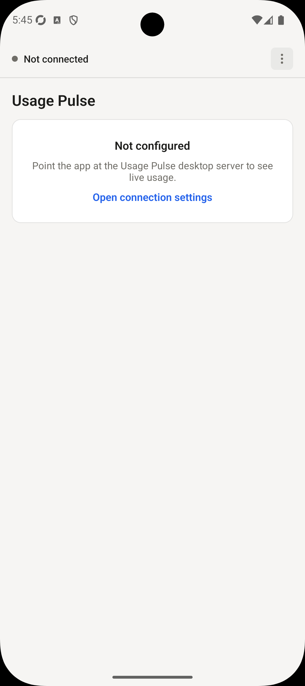
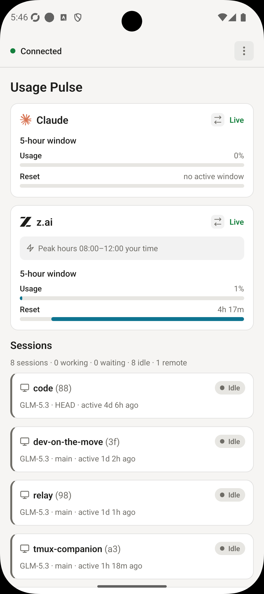
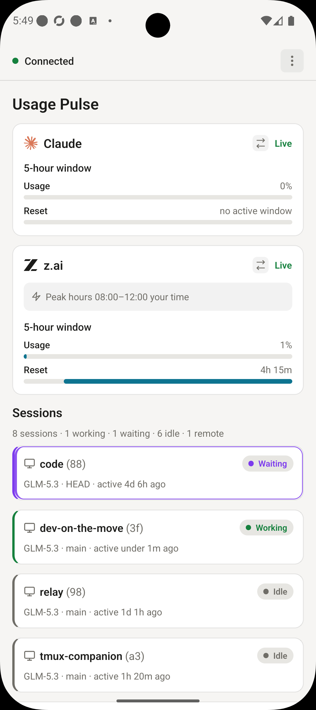
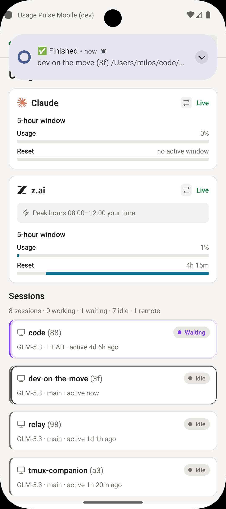
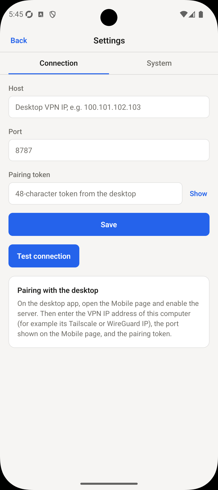
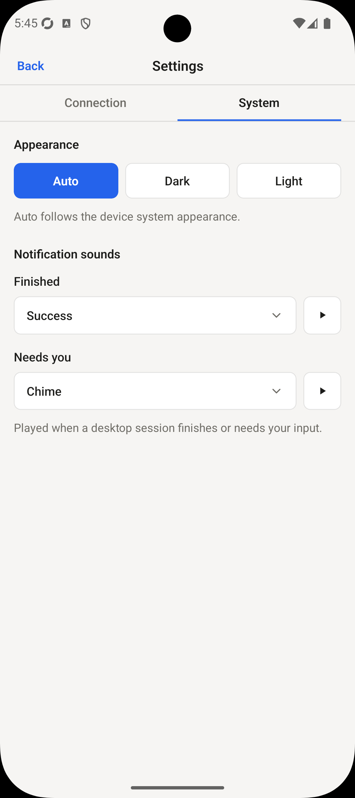

# Usage Pulse Mobile

<p align="center">
  
  
  
  
</p>

Mobile companion app for [Usage Pulse](https://github.com/beecode-rs/usage-pulse), the Electron desktop app
that tracks Claude and z.ai usage limits and running Claude Code sessions.

The phone connects to the desktop over the user's VPN (any VPN that gives
IP-level reachability, e.g. Tailscale or WireGuard), shows the same dashboard
data (one usage card per tracker plus live session rows), and fires local
notifications when a session finishes or a usage warning occurs. The app is
read-only: it has no controls for the desktop.

Built with Expo (React Native, TypeScript, Expo Router).

## Screenshots

|                                                                   Welcome                                                                    |                                                                            Dashboard                                                                            |                                                                                         Session in progress                                                                                          |
| :------------------------------------------------------------------------------------------------------------------------------------------: | :-------------------------------------------------------------------------------------------------------------------------------------------------------------: | :--------------------------------------------------------------------------------------------------------------------------------------------------------------------------------------------------: |
| <a href="resource/screenshots/welcome-screen.png"></a> | <a href="resource/screenshots/dashboard.png"></a> | <a href="resource/screenshots/dashboard-waiting-working.png"></a> |

|                                                                                        Session finished notification                                                                                         |                                                                                      Connection settings                                                                                       |                                                                                  App settings                                                                                  |
| :----------------------------------------------------------------------------------------------------------------------------------------------------------------------------------------------------------: | :--------------------------------------------------------------------------------------------------------------------------------------------------------------------------------------------: | :----------------------------------------------------------------------------------------------------------------------------------------------------------------------------: |
| <a href="resource/screenshots/notification-session-finished.png"></a> | <a href="resource/screenshots/settings-connection.png"></a> | <a href="resource/screenshots/settings-system.png"></a> |

## Download & install

Grab the latest artifacts from the [GitHub Releases](https://github.com/beecode-rs/usage-pulse-mobile/releases/latest) page. Every `v*` tag produces one Android APK and one iOS IPA.

### Android

1. Download the `UsagePulse-v<version>-android.apk` asset.
2. Allow installing unknown apps for your browser or file manager (Settings → Apps → Special access → Install unknown apps), then open the APK and confirm the install. Or install over USB: `adb install UsagePulse-v<version>-android.apk`.
3. To update, just install a newer APK over the old one — releases are signed with the same key.

### iOS

The `UsagePulse-v<version>-ios-unsigned.ipa` asset is **unsigned** (no Apple Developer account is involved), so it gets signed with your own Apple ID at install time by a sideload tool:

- **[AltStore](https://altstore.io)**: add the IPA through AltStore (or AltServer) with your Apple ID.
- **[Sideloadly](https://sideloadly.io)**: drag the IPA in, sign with your Apple ID, install over USB.
- On devices with **TrollStore**, the unsigned IPA can be installed directly and permanently.

Caveats: with a free Apple ID the signature lasts 7 days (re-sideload to refresh) and counts against the 3-active-apps limit. Connection settings are stored on-device, so expect to re-enter them after a reinstall.

## Setup

Requires [Node.js](https://nodejs.org) and [pnpm](https://pnpm.io).

```bash
git clone git@github.com:beecode-rs/usage-pulse-mobile.git
cd usage-pulse-mobile
pnpm install
```

Daily development commands are listed in [Scripts](resource/docs/scripts.md).

## Pairing with the desktop

1. On the desktop app, open the **Mobile** page in the side menu.
2. Enable the mobile server. Note the port (default `8787`, range 1024 to 65535) and copy the pairing token (a 48-character hex string; use
   **Regenerate** if you ever need a new one).
3. Make sure the phone can reach the desktop at IP level: connect both to a
   VPN such as Tailscale or WireGuard, and find the desktop's VPN IP address.
4. In the mobile app, open the connection settings screen (the **Settings**
   link in the dashboard's connection banner) and enter:
   - **Host**: the desktop's VPN IP
   - **Port**: the port from step 2
   - **Token**: the pairing token from step 2
5. Tap **Test connection** to verify (it reports success with the desktop app
   version, an unauthorized error for a bad token, or a network failure), then
   **Save**. The dashboard connects immediately.

## Connection architecture

- The desktop's Electron main process embeds a token-protected HTTP +
  WebSocket server bound to `0.0.0.0:<port>` (default 8787).
- REST: `GET /api/health` (health check) and `GET /api/state` (full
  hydration), both requiring `Authorization: Bearer <token>`.
- WebSocket: `/ws` authenticated with `?token=` on the upgrade (React Native
  WebSocket cannot set headers). On every (re)connection the server
  immediately pushes a full `state` message, so reconnects never show stale
  data. Afterwards it pushes live events: `usage-snapshot`,
  `sessions-snapshot`, `session-finished`, `usage-warning`, and `heartbeat`.
- Stability: a server heartbeat every 30 s (protocol ping plus an app-level
  `heartbeat` message, because React Native cannot observe protocol pings), a
  client liveness watchdog (75 s without any message forces a reconnect), and
  client auto-reconnect with exponential backoff (1 s doubling, capped at
  30 s, reset after a successful connection).
- The transport is plaintext HTTP/WS. That is acceptable because this is a
  personal tool confined to the VPN/LAN; the token prevents casual access
  from other machines on the same networks. There is no TLS.

## Notifications

When a session transitions from BUSY to IDLE, or a usage window crosses the
85% (high usage) or 95% (limit reached) threshold upward, or a tracker enters
an error state, the app shows a local notification (Android channel
`usage-pulse-alerts`).

Limitations:

- Notifications are local only (no push relay, no accounts). They are
  delivered while the app is running and connected, in the foreground or
  backgrounded-but-alive. They are **not** delivered when the app has been
  killed.
- `expo-notifications` does not work inside Expo Go (SDK 53+). Verify
  notifications with a [development build](resource/docs/development-build.md).

## Development & releasing

- [Scripts](resource/docs/scripts.md) — typecheck, contract tests, lint, dev
  server, rebuilds, and release helpers
- [Development build](resource/docs/development-build.md) — on-device
  verification builds (dev variant, cleartext traffic)
- [Releasing](resource/docs/releasing.md) — tag-driven releases and the
  one-time Android signing setup
- [Wire contract sync](resource/docs/wire-contract.md) — keeping the mobile
  model/schema mirror aligned with the desktop app

## iOS caveat

Android is configured with `expo.android.usesCleartextTraffic: true` because
`http://` and `ws://` are both cleartext. On iOS, release builds enforce App
Transport Security restrictions that may need extra configuration to allow
cleartext traffic. This is untested in this repository; iOS support is best
effort.

## License

[MIT](LICENSE)
