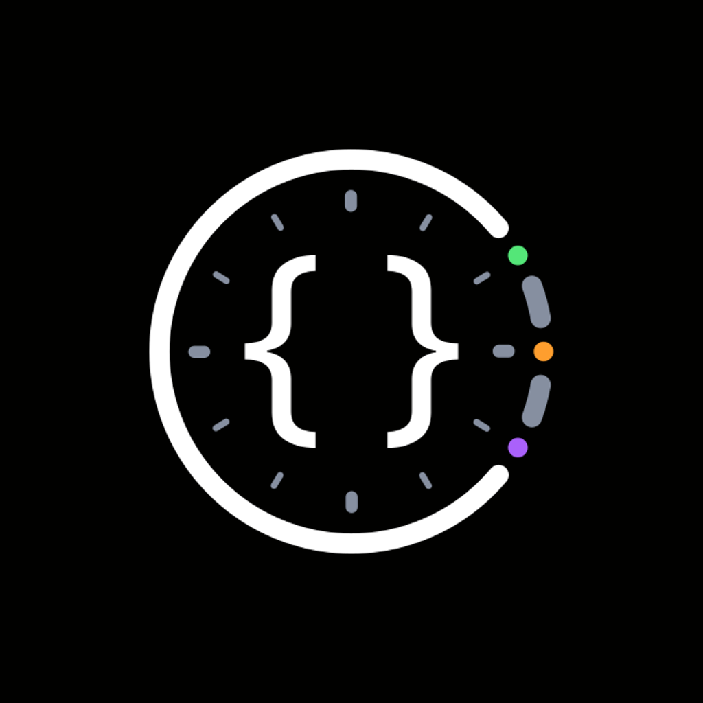

<p align="center">
  
</p>

<h1 align="center">Usage Pulse Mobile</h1>

<p align="center">
  
  
  
  
  
</p>

<p align="center">
  Made by
  <a href="https://beecode.rs"></a>
  <a href="https://beecode.rs"><strong>Beecode</strong></a>
</p>

Usage Pulse Mobile is a small Expo (React Native) companion app for [Usage Pulse](https://github.com/beecode-rs/usage-pulse), the Electron desktop app that tracks Claude and z.ai usage limits and running Claude Code sessions. The phone connects to the desktop over your VPN and mirrors its dashboard on the go. It does 3 things:

- **Dashboard** — shows the same live data as the desktop app: one usage card per tracker plus live session rows.
- **Notifications** — fires local alerts when a session finishes, a session starts waiting for your input, or a usage warning occurs.
- **Sounds** — picks a notification sound per event (session finished, session waiting), from silent to system default to built-in sounds.

The app is read-only: it has no controls for the desktop.

## Status: Proof of Concept

Usage Pulse Mobile is at **v0.1.0** and still a proof of concept. It was built through rapid AI-assisted iteration ("vibe coding") rather than carefully reviewed engineering, so expect rough edges, missing pieces, and breaking changes without notice. While it remains a POC the version stays on `0.x`; the move out of the POC phase coincides with the major version moving to `1`.

## Screenshots

| Welcome | [Dashboard](resource/docs/features.md#dashboard) | [Session in progress](resource/docs/features.md#dashboard) |
| :---: | :---: | :---: |
| <a href="resource/screenshots/welcome-screen.png"></a> | <a href="resource/screenshots/dashboard.png"></a> | <a href="resource/screenshots/dashboard-waiting-working.png"></a> |

| [Session finished notification](resource/docs/features.md#notifications) | [Connection settings](resource/docs/features.md#settings) | [App settings](resource/docs/features.md#settings) |
| :---: | :---: | :---: |
| <a href="resource/screenshots/notification-session-finished.png"></a> | <a href="resource/screenshots/settings-connection.png"></a> | <a href="resource/screenshots/settings-system.png"></a> |

The titles link to each feature's section in [resource/docs/features.md](resource/docs/features.md).

## Features

- **Dashboard** — one usage card per tracker plus live session rows, kept current over the VPN connection.
- **Notifications** — local alerts when a session finishes, a session starts waiting for your input, a usage window crosses 85% (high usage) or 95% (limit reached), or a tracker enters an error state.
- **Sounds** — a notification sound per event (session finished, session waiting), with silent and system-default options.
- **Connection settings** — host, port, and pairing token, with a one-tap test that reports exactly what is wrong.
- **Theme** — light, dark, or follows the system setting.

For a deeper look at each feature — settings, edge cases, and how things work under the hood — see [resource/docs/features.md](resource/docs/features.md).

## Feature status

Done:

- [x] Live dashboard mirroring the desktop app (usage cards + session rows)
- [x] Session-finished, session-waiting, usage-warning, and tracker-error notifications
- [x] Per-event notification sounds
- [x] Connection settings with test connection
- [x] Light/dark/auto theme

Planned:

Nothing planned right now.

## Requirements

**To use the app:** the [Usage Pulse](https://github.com/beecode-rs/usage-pulse) desktop app with its mobile server enabled, and a VPN (e.g. Tailscale or WireGuard) connecting the phone to the desktop.

**To build from source:** [Node.js](https://nodejs.org) and [pnpm](https://pnpm.io).

## Download & install

Downloads live on the [GitHub Releases](https://github.com/beecode-rs/usage-pulse-mobile/releases) page.

### Android

1. Download the `UsagePulse-v<version>-android.apk` asset.
2. Allow installing unknown apps for your browser or file manager (Settings → Apps → Special access → Install unknown apps), then open the APK and confirm the install. Or install over USB: `adb install UsagePulse-v<version>-android.apk`.
3. To update, just install a newer APK over the old one — releases are signed with the same key.

### iOS

The `UsagePulse-v<version>-ios-unsigned.ipa` asset is **unsigned** (no Apple Developer account is involved), so it gets signed with your own Apple ID at install time by a sideload tool:

- **[AltStore](https://altstore.io)**: add the IPA through AltStore (or AltServer) with your Apple ID.
- **[Sideloadly](https://sideloadly.io)**: drag the IPA in, sign with your Apple ID, install over USB.
- On devices with **TrollStore**, the unsigned IPA can be installed directly and permanently.

Caveats: with a free Apple ID the signature lasts 7 days (re-sideload to refresh) and counts against the 3-active-apps limit. Connection settings live in the app's on-device storage, so a reinstall loses them — expect to re-enter the host, port, and token.

### From source

Requires [Node.js](https://nodejs.org) and [pnpm](https://pnpm.io).

```bash
git clone https://github.com/beecode-rs/usage-pulse-mobile.git
cd usage-pulse-mobile
pnpm install
pnpm start
```

`pnpm start` needs a development build on a connected device or emulator — Expo Go cannot exercise notifications. The full development setup lives in [resource/docs/development.md](resource/docs/development.md).

## Getting started

1. On the desktop app, open the **Mobile** page in the side menu and enable the mobile server.
2. Note the port (default `8787`) and copy the pairing token (a 48-character hex string; use **Regenerate** if you ever need a new one).
3. Connect the phone and the desktop to the same VPN (e.g. Tailscale or WireGuard) and find the desktop's VPN IP address.
4. In the mobile app, open the connection settings (the **Settings** link in the dashboard's connection banner) and enter the desktop's VPN IP, the port, and the pairing token.
5. Tap **Test connection** to verify — it reports success with the desktop app version, an unauthorized error for a bad token, or a network failure.
6. Tap **Save**. The dashboard connects immediately.

## Privacy & security

**The pairing token and your connection settings** stay on your device, stored in the app's local storage, and are sent only to your own Usage Pulse desktop server. The app contains no analytics and no telemetry.

Traffic to the desktop travels as plaintext HTTP/WebSocket inside your VPN — the token gates access, but there is no TLS, so keep the connection on a VPN or LAN you trust.

## Support & contributing

Found a bug or have an idea? Open an issue on [GitHub](https://github.com/beecode-rs/usage-pulse-mobile/issues) — include the app version, your OS, and the steps to reproduce. Pull requests are welcome too; keep the [feature status](#feature-status) in mind, and open an issue before starting something large.

## For developers

The README covers using the app. To work on it:

- [Development setup](resource/docs/development.md) — prerequisites, daily commands, quality gates, and device builds
- [Scripts](resource/docs/scripts.md) — every `package.json` script and what it runs
- [Releasing](resource/docs/releasing.md) — tag-driven releases and the one-time Android signing setup
- [Wire contract](resource/docs/wire-contract.md) — the desktop ↔ mobile wire protocol and keeping the model/schema mirror in sync

## License

[MIT](LICENSE)
